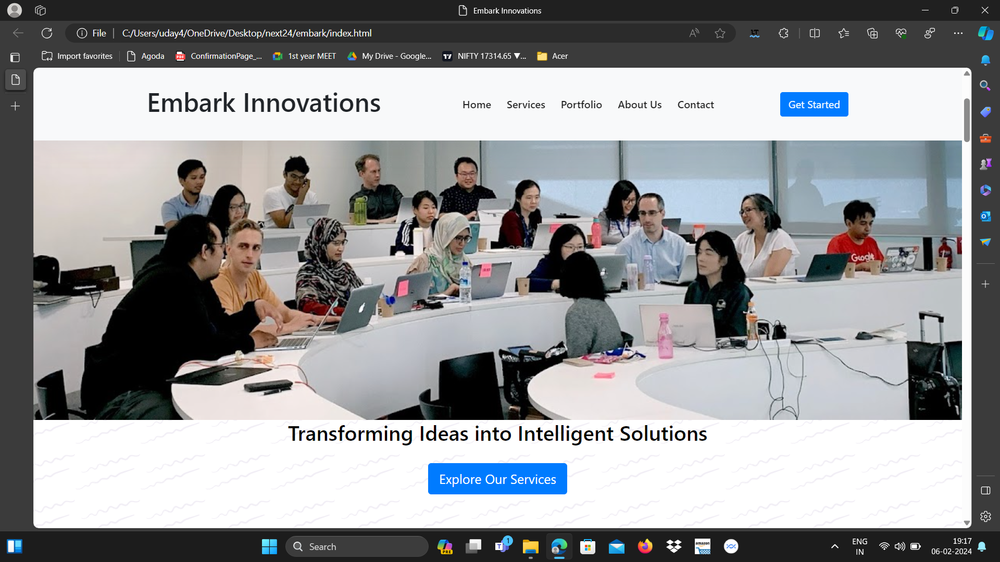
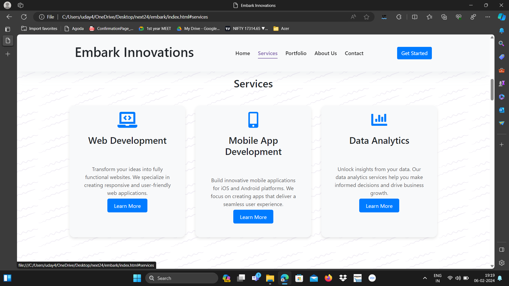
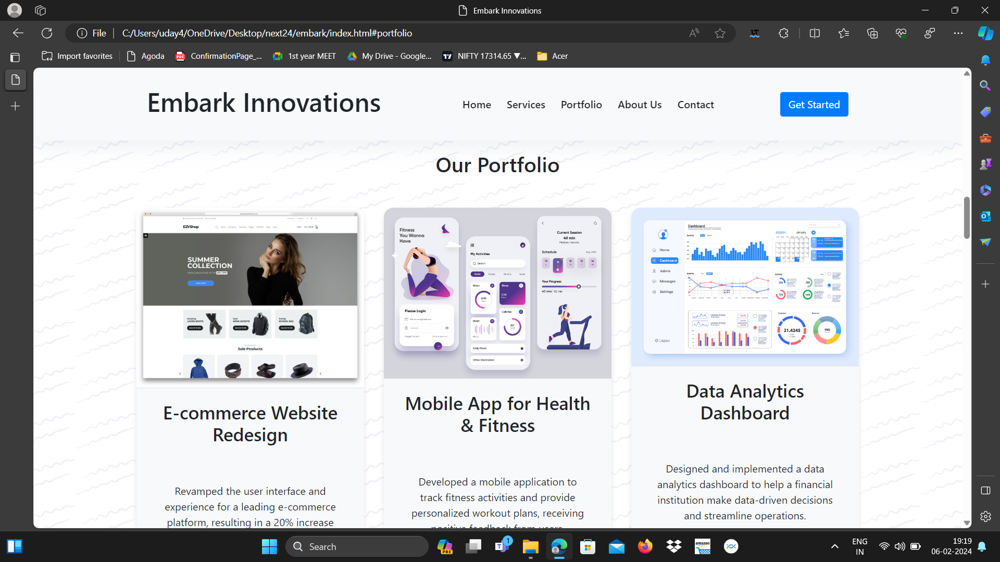
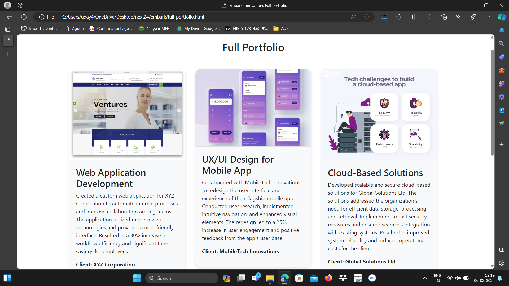
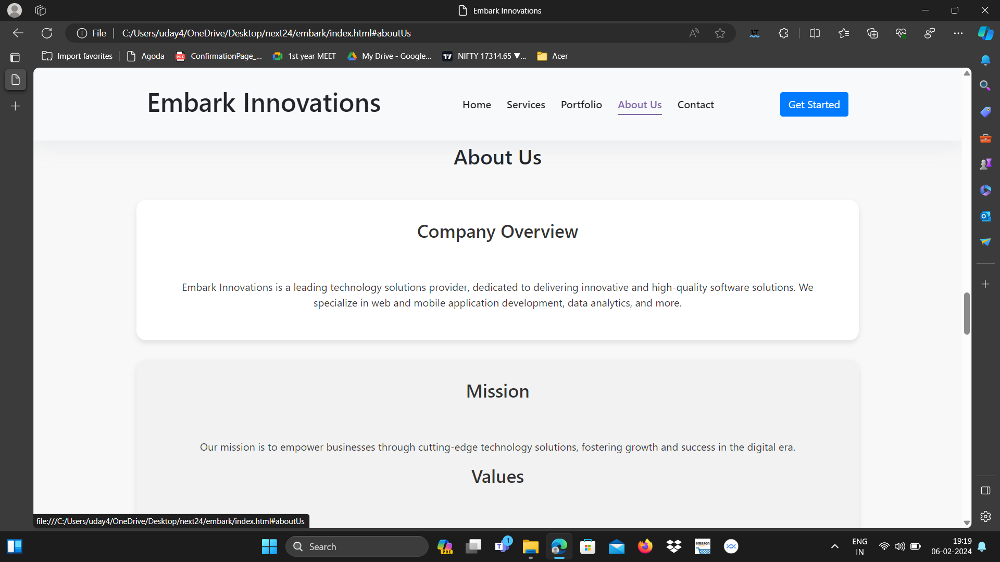
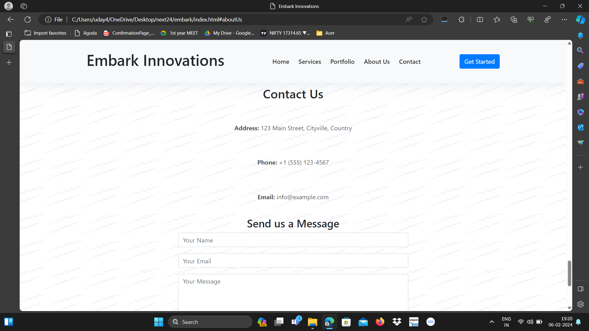
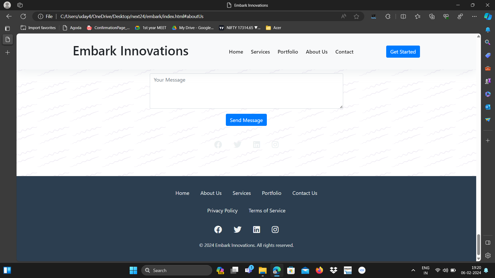

# Embark Innovations Website

Welcome to the official repository for the Embark Innovations website, developed by Udyavara Uday Shankar during the Web Development Internship at Next24tech Technology & Services. This repository contains the source code for our company website, showcasing our services, portfolio, and more.

## Table of Contents

- [Features](#features)
- [Demo](#demo)
- [Installation](#installation)

## Features

- Responsive design for various devices.
- Clean and modern interface with Embark's branding colors.
- Sections for Home, Services, Portfolio, About Us, and Contact.
- Interactive elements like buttons and forms.
- Easy navigation with a user-friendly interface.

## Demo

Check out our demo video [here](https://drive.google.com/file/d/14_A_CJ7l1orBCqCrl5D4lVDEW_Vqm5u3/view?usp=sharing).

### Screenshotsl

## Installation

1. Clone the repository:
git clone https://github.com/UdayShankar3953/embark-innovations-website.git

2. Navigate to the project folder:
cd embark

3. Open the index.html file in your preferred web browser.

